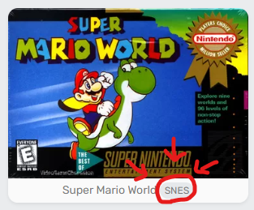
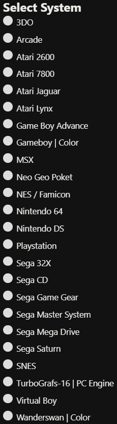
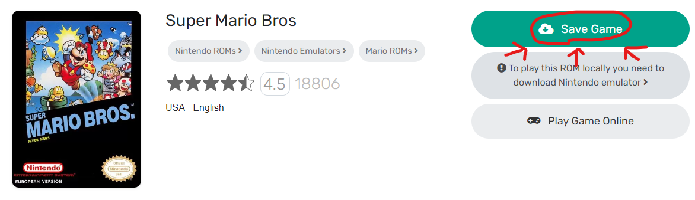
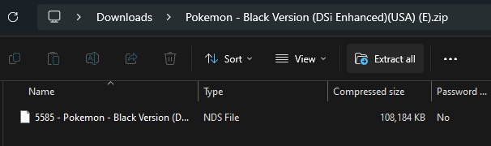
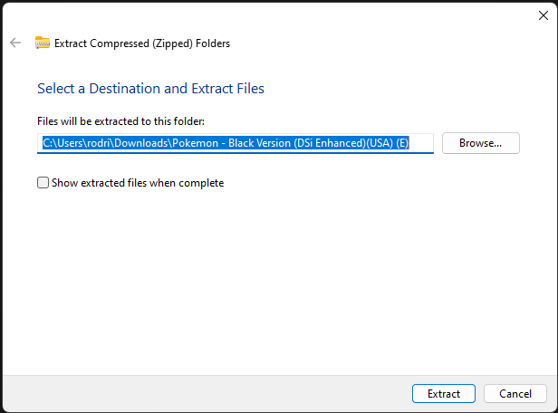
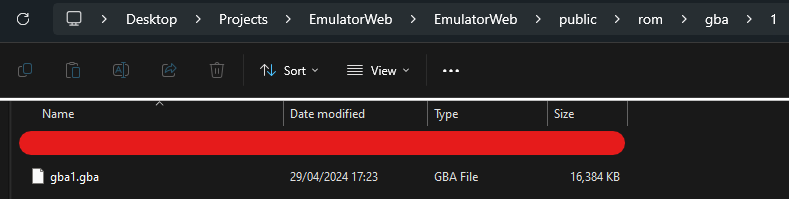
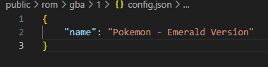

# 1 - How to add games to EmulatorWeb

[< Back to Usage](README.md)

## Step 1: Download a game ROM

Navigate to a website like [EmulatorGames.net](https://emulatorgames.net) and find a game.

## Step 2: Check the game's device

Check what device the game was made for. It should say that here:

*Figure 1.2a: Where to find the supported device.*

If the game isn't supported by EmulatorWeb or EmulatorJS, don't bother using it. Here's a list of supported devices:
 

*Figure 1.2b: A list of supported devices by EmulatorJS.*

## Step 3: Download the ROM

Click on the button that says "Save Game". It should look like this:
 

*Figure 1.3a: The location of the "Save Game" button.*

## Step 4: Extract the file

Click into the .zip file and above, it should say "Extract All". Click that.
 

*Figure 1.4a: The "Extract All" button.*
 
Then, an extraction wizard should pop up. Just click Extract.
 

*Figure 1.4b: The extraction wizard.*

## Step 5: Add the ROM

Drag the ROM to `public/[device name]/[game id]`
*e.g. `public/gba/1`*
Set the name of the ROM file to `[device name][game id].[file extension]`
*e.g. `gba1.gba` if the device was gba and the id was 1*.
 

*Figure 1.5a: The ROM so far.*

## Step 6: Configuring the ROM

Create a file called `config.json` in the same directory as the ROM file.
Then, enter the following into the JSON file (set the value of `"name"` to the name of the game):
 

*Figure 1.6a: The JSON file.*