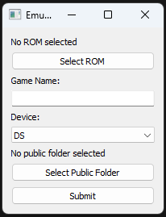

# 2 - How to add games to EmulatorWeb

[< Back to Usage](README.md)

## Step 1: Follow steps 1-5 on Chapter 1

Follow those steps. They are the exact same starting steps.

## Step 2: Download EmulatorWeb Game Installer

Here's a download link for it:

https://github.com/EmulatorWeb/game-installer/releases

## Step 3: Open the App and Complete the Form
Launch the `main.exe` file. The interface should resemble the following:

*Figure 2.3a: Expected Interface*

    The "Public Folder" is the folder named /public on the repository.

Ensure that you complete the form accurately to prevent any unintended folder creations elsewhere, which could disrupt the website's functionality.

**At present, there exists a bug causing the application to crash upon attempting to upload the same game from the identical location twice. This issue arises due to the relocation of the ROM from its original folder to the new destination.**